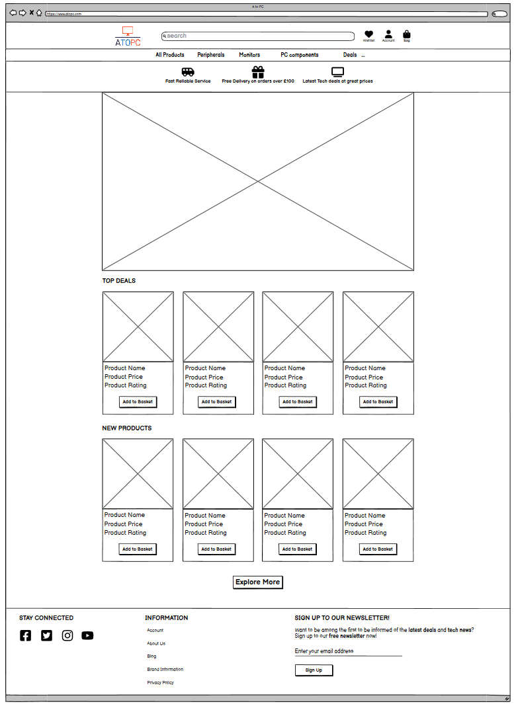
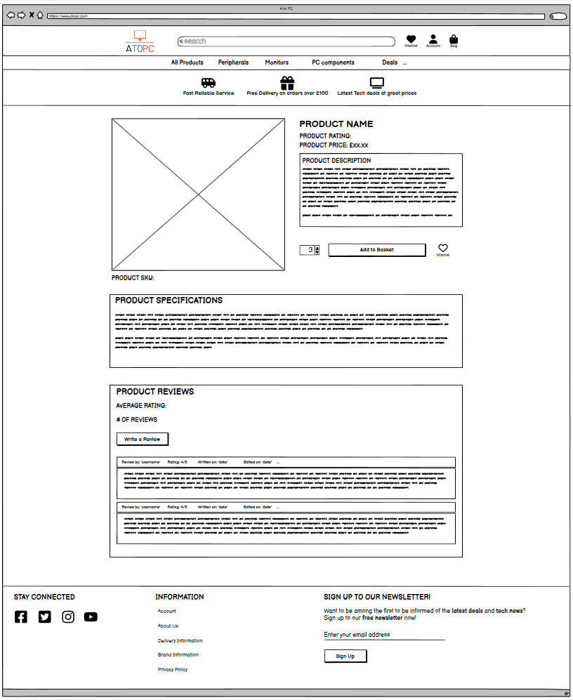
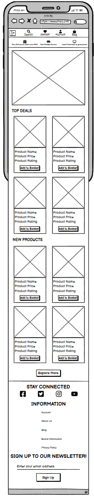
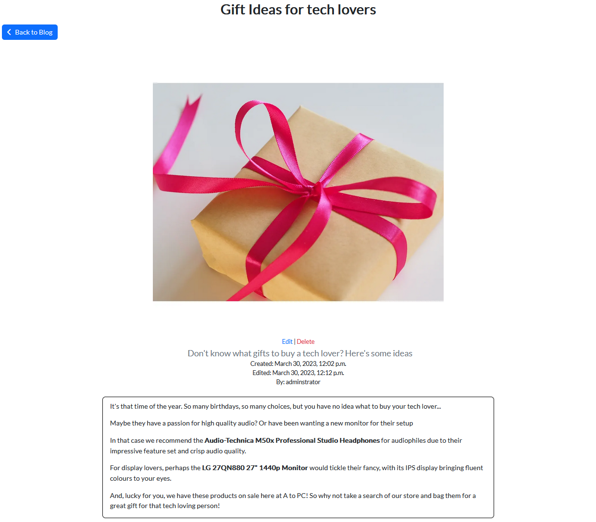
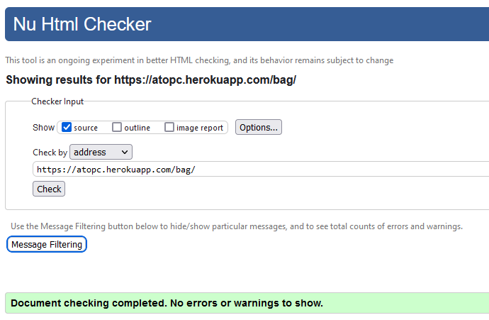
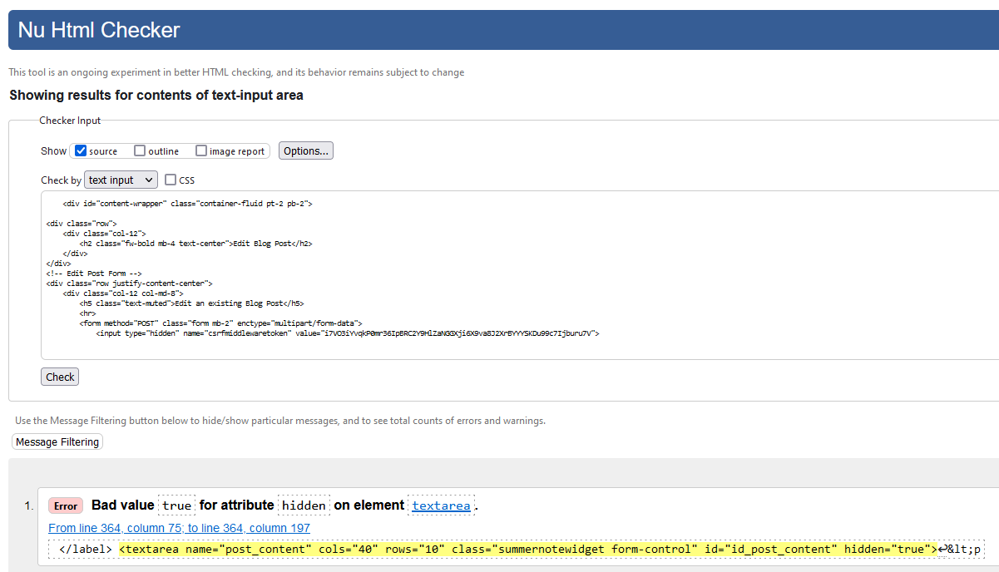
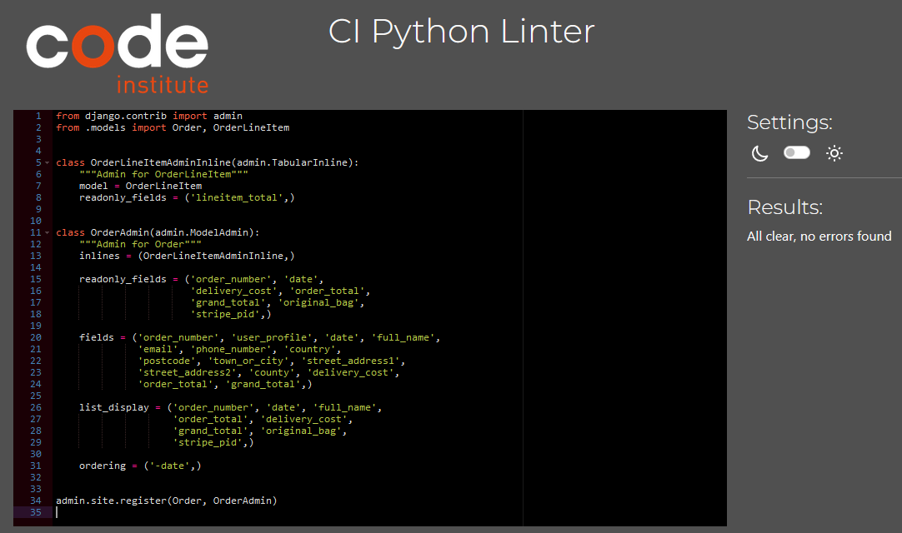
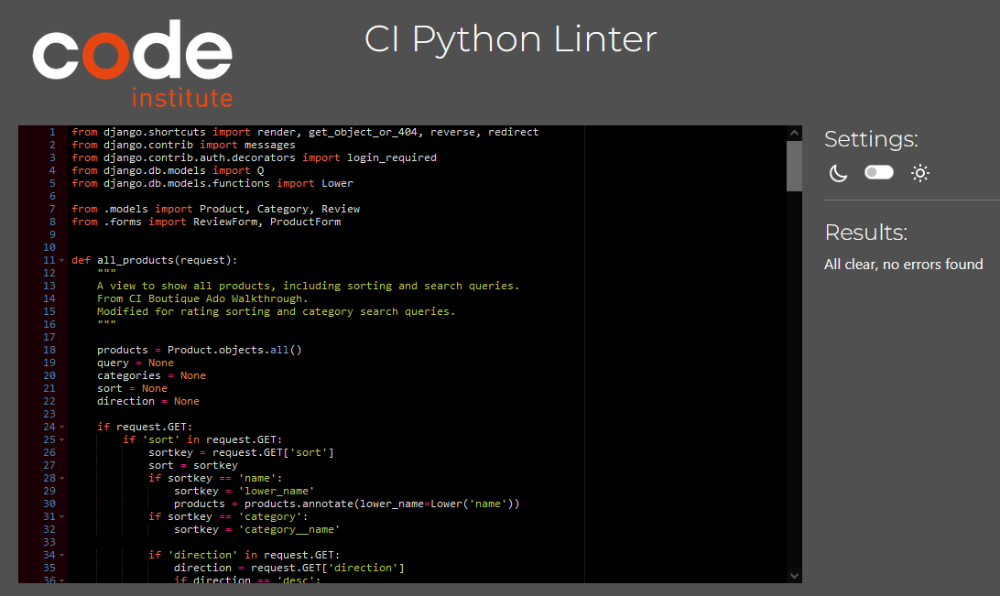

<h1 align="center">A to PC</h1>

## Introduction
A to PC is an online E-commerce store that is focused on selling PC monitors, storage and peripherals to customers. Users can browse a list of products and make purchases from the available products by filling out their delivery and billing information. Users also have the option to leave a review and rate products and can view and comment on blog posts in the site blog. This site is aimed at tech shoppers who are looking to purchase PC monitors, storage or peripherals.

[The live site can be accessed here.](https://atopc.herokuapp.com/)

## Table of Contents
1. [User Experience](#user-experience)
    - [Target Audience](#target-audience)
    - [User Stories](#user-stories)
    - [Unfinished User Stories](#unfinished-user-stories)
    - [Scope](#scope)
2. [Design](#design)
    - [Colours](#colours)
    - [Font Style](#font-style)
    - [Wireframes](#wireframes)
    - [Database Schema](#database-schema)
3. [Marketing](#marketing)
    - [Business Model](#business-model)
    - [Search Engine Optimization (SEO)](#search-engine-optimization-seo)
    - [Facebook Mockup](#facebook-mockup)
    - [Newsletter](#newsletter)
4. [Features](#features)
    - [Navbar](#navbar)
    - [Promotion banner](#promotion-banner)
    - [Footer](#footer)
    - [Home](#home)
    - [About us](#about-us)
    - [Privacy Policy](#privacy-policy)
    - [All Products](#all-products)
    - [Product Detail](#product-detail)
    - [Add Product](#add-product)
    - [Edit Product](#edit-product)
    - [Delete Product](#delete-product)
    - [Edit Review](#edit-review)
    - [Delete Review](#delete-review)
    - [Shopping Bag](#shopping-bag)
    - [Checkout](#checkout)
    - [Wishlist](#wishlist)
    - [Profile](#profile)
    - [Blog](#blog)
    - [Blog Post](#blog-post)
    - [Add Blog Post](#add-blog-post)
    - [Edit Blog Post](#edit-blog-post)
    - [Delete Blog Post](#delete-blog-post)
    - [Edit Comment](#edit-comment)
    - [Delete Comment](#delete-comment)
    - [Newsletter Page](#newsletter-page)
    - [Sign Up, Sign In and Sign Out](#sign-up-sign-in-and-sign-out)
    - [Error Pages](#error-pages)
5. [Future Features](#future-features)
6. [Technologies](#technologies)
7. [Testing](#testing)
    - [Validator Testing](#validator-testing)
    - [Lighthouse Testing](#lighthouse-testing)
    - [Responsiveness Testing](#responsiveness-testing)
    - [Automated Testing](#automated-testing)
    - [Manual Testing](#manual-testing)

## User Experience

### Target Audience
A to PC was designed as a Business-to-customer(B2C) e-commerce store with a focus of selling PC monitors, storage and peripherals to customers. The users visiting this site will have basic knowledge of tech products and be looking to browse and purchase products that the website offers. Some users visiting this site may also be looking to leave a review on a product, sign up to the newsletter or browse the site blog. As the main purpose of the site is to sell products to customers, it was decided that the process of purchasing an item should be simple and hassle-free, with clear navigation for users to find what they are looking for and proceed to checkout.

### User Stories
Using github projects I created a series of user stories related to the site and its purpose. To follow the process of Agile Development, I used MoSCoW prioritization to label each story. These can be found [here.](https://github.com/users/JackDay94/projects/4)

The user stories can be divided into the following Epics:
1. Epic 1 - User Authentication and Account
    - As a site user I can register an account so that I can make purchases and review products. (must-have)
        - Acceptance Criteria: User can successfully register for an account using username, password and email.
    - As a site user/ owner I can sign into and sign out of my account to access certain site features that require being signed in when I need to. (must-have)
        - Acceptance Criteria: User can sign in/out of their registered account.
    - As a site user I can recover my forgotten password so that I am able to login to my account again. (should-have)
        - Acceptance Criteria: User can reset their password by providing their email used to register.
    - As a site user I can view my own personalised profile to see and update details of my order history and delivery/billing information. (should-have)
        - Acceptance Criteria: User profile created after registering, User has own profile page, User can view order history, User can view/edit delivery/billing info.
2. Epic 2 - Navigating the site
    - As a site user/ owner I can navigate pages of the site to find the content I wish to see with ease. (must-have)
        - Acceptance Criteria: Page links clear to user, Page links work, Page links named correctly.
    - As a site user I can browse between pages of products by clicking the next or prev page buttons to find products I may be looking for. (should-have)
        - Acceptance Criteria: Products page split into multiple pages, User can go back and forward between pages.
    - As a site user I can click on links to bring me to the social media pages for the website so that I can get involved. (could-have)
        - Acceptance Criteria: Social media links in footer, Social media pages open in new tab.
3. Epic 3 - Products
    - As a site user I can browse a list of products that are on sale so that I can make a choice on what to purchase. (must-have)
        - Acceptance Criteria: List of products displayed on page.
    - As a site user I can view the details of a product to find out more information about it to help me make a purchase. (must-have)
        - Acceptance Criteria: Product image, price, rating, description on product page, Each product has its own detail page.
    - As a site user I can search for products so that I can find what I am looking for easier. (should-have)
        - Acceptance Criteria: Searching in search box returns relevant products.
    - As a site user I can sort a list of products by rating, name, price and category to find certain products easier. (should-have)
        - Acceptance Criteria: Products list can be sorted by rating, name, price and category.
    - As a site user I can filter a list of products based on certain criteria to help me find products easier. (should-have)
        - Acceptance Criteria: Product list can be filtered to display certain products that match the filter criteria.
    - As a site user I can view discounts that I can apply to a product so that I can get some money off a purchase. (could-have)
        - Acceptance Criteria: Discounts shown for products, User can apply discounts to a product.
    - As a site admin I can add/edit/delete discounts from the store to encourage users to purchase discounted items. (could-have)
        - Acceptance Criteria: Admin can create discount codes, Admin can edit discount codes, Admin can delete discount codes, Admin can set discount codes for specific products.
4. Epic 4 - Reviews and ratings
    - As a site user I can view the average rating and reviews for a product to see what other people are saying about a product. (must-have)
        - Acceptance Criteria: Product reviews visible on product page, Product rating is average of user ratings, Average rating shown for products.
    - As a site user I can leave a rating and review on a product to share my opinion and experiences with others. (must-have)
        - Acceptance Criteria: User can write a review and add a rating for a product, User reviews appear on associated product page.
    - As a site admin/user I can update and delete reviews that I have made to change my opinion on a product or remove my review of the product. (must-have)
        - Acceptance Criteria: User can edit their review, User can delete their review, Admin can edit/delete any review, User cannot edit/delete other users reviews.
5. Epic 5 - Purchasing products
    - As a site user I can choose the quantity of the item that I want to purchase. (must-have)
        - Acceptance Criteria: User can increase/decrease quantity of items, User cannot add 0 or less items.
    - As a site user I can add or remove a product to my bag so that I make a decision on my purchase. (must-have)
        - Acceptance Criteria: Products can be added to bag, Products can be removed from bag.
    - As a site user I can view the total cost of the items in my bag so that I know how much I need to pay before completing my purchase. (must-have)
        - Acceptance Criteria: Bag displays products currently added, Bag shows quantity and price of each product in it, Bag shows total price of its contents.
    - As a site user I can checkout the items in my bag to enter my payment and delivery details and complete my purchase. (must-have)
        - Acceptance Criteria: Checkout displays a summary of bag contents, Checkout displays delivery information, Checkout displays card payment information, Checkout shows order confirmation page on successful purchase.
    - As a site user I can receive a notification by email when I make a purchase to show me the details of my purchase. (must-have)
        - Acceptance Criteria: User receives email after making purchase, Email contains order confirmation for the purchase.
6. Epic 6 - Wishlist
    - As a site user I can view my wishlist to see what I currently have added. (could-have)
        - Acceptance Criteria: User can access their wishlist page, Wishlist shows items currently added.
    - As a site user I can add/delete items to my wishlist so that I can save them to purchase at a later date or remove them when I don't want them anymore. (could-have)
        - Acceptance Criteria: User can add a product to their wishlist, User can remove a product from their wishlist.
7. Epic 7 - Blog
    - As a site user I can view blog posts made by the site to get updates on certain topics. (could-have)
        - Acceptance Criteria: List of blog posts available on the site, User can click on blog posts to view their content.
    - As a site admin I can add, edit and delete blog posts to the site to keep users updated on site news. (could-have)
        - Acceptance Criteria: Admin can add new blog posts, Admin can edit existing blog posts, Admin can delete blog posts, Users cannot add/edit/delete blog posts.
8. Epic 8 - Newsletter
    - As a site user I can use my email to sign up to a newsletter to be notified of deals and news. (should-have)
        - Acceptance Criteria: User can submit their email to a newsletter signup form, User is notified they have signed up successfully, Admin can see emails registered to newsletter.
9. Epic 9 - Admin management
    - As a site admin I can add new products to the existing product list to expand the available products in store. (must-have)
        - Acceptance Criteria: Admin can add products to site using product form, Newly added products show correctly in the store, Users cannot add products.
    - As a site admin I can edit and delete existing products to allow me to update product details or remove a product from the store. (must-have)
        - Acceptance Criteria: Admin can edit existing products, Admin can delete existing products, Product list updated to reflect edited/deleted products, Users cannot edit/delete products.

### Unfinished User Stories
For this project I employed an Agile approach through the use of github projects to plan and track user stories through the course of development. At the start of the project I created user stories that would fit the goal of the project and labelled these based on priority as either must-have, should-have or could-have. Initially all user stories were placed in the 'Todo' column, and as the project progressed and I began to work on a user story, I moved them to the 'In progress' column. When a user story was completed, I then moved it to the 'Done' column and moved on to the next. Overall a total of 26/29 user stories were completed.

Unfortunately, due to time constraints, I was unable to complete 3 of my user stories. However, these are not required for the site to function as needed and were considered a lower priority.

### Scope
With the target audience and business goals in mind, I set out to create a site that will function to meet their needs. To do this I chose to include the following features:

- Product page with a list of products on sale that can be sorted and filtered.
- Product detail page with a detail view of a chosen product showing product information, price etc.
- Responsive navbar with links to other pages in the store.
- Account creation and ability to login/logout for users.
- Profile page with default delivery/billing info and order history for users.
- Ability to add products to a bag and proceed to checkout to purchase items.
- Users can leave product reviews and ratings.
- Users can sign up to a newsletter mailing list.
- Home page to entice users to browse the rest of the store.

## Design

### Colours
To help users navigate the site better I wanted to ensure that the colour scheme was pleasant and not distracting from the main site content. I chose to use a mix of light and dark colours for the site, with the main content body having a white background and the top info banner and footer using darker backgrounds to seperate the content. The site uses mostly primary colours with the buttons and links, such as submit buttons for forms using a green colour to signify they are for submitting. I tried to keep a consistent colour scheme throughout the pages of the site to help provide a sense of fluidity when exploring the site.

### Font Style
I wanted to use a simple and easily readable font for the site, since the main purpose of the site is to provide products for a user to purchase. For this I chose the 'Lato' font style from Google Fonts as it is easy to read and clear on different screen sizes. I used a bold font weight for headings and some sub-headings to distinguish them from the rest of the content on the page.

### Wireframes
I used Balsamiq wireframes to create a set of basic wireframes for this project. I used the layouts from the wireframes as reference when creating the pages for the site and then adjusted content on the pages to make them fit better. For this reason, the wireframes do not 100% portray the end product.

Desktop

Home

All Products

Product detail

Add Product

Edit Product

Register and Login

Bag

Checkout

Profile

Mobile

Home

All Products

Product detail

Add Product

Edit Product

Register and Login

Bag

Checkout

Profile

### Database Schema
I used LucidChart to draw an entity relationship diagram to show how the models of my project relate to each other as seen below.

## Marketing

### Business Model
A to PC is designed a Business-to-Customer (B2C) application that sells products, and I therefore wanted to give the site a design and feature set that appealed to customers wanting to make online purchases. This included features such as:

- Simple and easy payment system
- Clear product descriptions and images
- Ability to search for products and filter results
- Ability to add products to a bag and view them
- Review and rating system to find products with high ratings
- Authentication system for users to create accounts
- Wishlist functionality for products

### Search Engine Optimization (SEO)
To help A to PC appear higher in searches I conducted some research into SEO to improve its search ranking. In order to do so I thought about what keywords my target audience would search for when looking to purchase products. Once I had an idea of some keywords, I began searching them in Google to see if the results showed similar e-commerce websites and took note of keywords which gave higher quality results. I also used [wordtracker.com](https://www.wordtracker.com/) to look at search traffic for keywords and find alternate keywords. Once I had a mixture of short-tail and long-tail keywords I then included them in my meta keywords tag in base.html.

Keywords

- PC parts
- Computer parts
- PC peripherals
- PC monitors
- Keyboards
- Computer mouse
- PC storage
- PC peripheral deals
- PC storage deals
- Cheap computer monitors
- Buy PC peripherals online
- Buy computer monitors online

To provide further SEO, I also included a meta description tag with a short description of the site that uses some of the keywords from above to help draw users to the site and provide better search results. Unique page titles were also used for each page of the site, with product pages using the product name as the page title. This was intended to help search engines rank the site higher for when users search for specific products.

I also included a sitemap.xml and a robots.txt file for search engines to crawl essential pages on the website and speed up content discovery and to prevent them from going to areas of the site that are disallowed.

### Facebook Mockup
To help boost the online presence of the store and potentially attract new customers, I created a mockup Facebook page for the store using the CI Facebook template. Other social media applications such as Twitter, Instagram and Youtube were also considered to help market the site and increase its influence on social media, but these were not included yet.

### Newsletter
I included a newsletter signup for users to register their name and email address to receive updates and offers from the site to increase their chances of returning. When a user enters their email and name into the newsletter signup form and submits, their email is then added to mailing list database, ready to receive emails from the site. Currently no emails are sent from the site, but this could be changed in the future.

## Features

### Navbar
- The navbar is fixed to the top of the screen and allows users to easily reach other pages of the site using the dropdown options, or search the site with the search bar.

- The Account dropdown changes depending on whether the user is signed in or is a superuser.

- The navbar is fully responsive and collapses to a menu on smaller screens.

### Promotion banner
- Directly below the navbar is a promotion banner advertising the site and enticing users to stay and explore. This is also fixed to the top and present on all pages.

### Footer
- The Footer is split into 3 sections: social media links, site information links, newsletter signup. If a user is signed in the 'My Profile' link becomes visible, and if a superuser is signed in the 'Admin' link becomes visible. The footer is visible on all pages.

### Home
- The first thing users see when they enter the home page of the site is a large splash image advertising the deals on sale with a link to products filtered by deals. This was done to make users click into the site and start exploring the products on sale.

- Below the splash image is a list of products filtered and ordered by different criteria. There is the 4 newest products to the site, top 4 rated peripherals, top 4 rated monitors and the top 4 rated storage. This was done to give users quick access to products based on ratings and advertise the newest products in store.

- At the bottom of the home page is a preview of the 4 latest blog posts from the site blog, with a button taking users to the rest of the blog.

### About Us
- The about us page gives a brief overview of the site goals and what it is all about.

### Privacy Policy
- The privacy policy for the site was generated using [privacypolicygenerator](https://www.privacypolicygenerator.info/). This details how the data of users who visit the site will be used.

### All Products
- The all products page displays a list of all the products on sale. At the top of the page is a selection box for sorting products in different ways, such as name, rating, price and category. Each product shown in the list shows an image, name, price, rating, category and an 'add to bag' button which adds the product to the users bag when clicked. If a superuser is logged in, there are also edit and delete buttons just above the 'add to bag' button.

- If there are no products available, the user is informed that no products were found.

### Product Detail
- The product detail page gives an overview of a product and allows users to add it to enter a quantity to purchase or add to their wishlist with the wishlist button.

- At the bottom of the product detail page are the reviews for the product. When a user is signed in they have the option to leave a review on the product, otherwise the reviews from all other users are shown.

### Add Product
- The add product page allows superusers to add a new product to the store by filling out the form on the page.
- This page can only be accessed by superusers and any other user trying to access it will be redirected with a 403 error.
- When the form is submitted, the page is redirected to the new product page and a success message is displayed.

### Edit Product
- This page displays the current products details in a form and allows a superuser to edit them.
- When a superuser enters this page, a message is displayed informing them that they are editing the product.
- This page can only be accessed by superusers and any other user trying to access it will be redirected with a 403 error.
- When the form is submitted, the page is redirected to the product page and a success message is displayed.

### Delete Product
- This page displays a confirmation message to delete an existing product.
- Below the submission button is a preview of the product that is about to be deleted.
- An alert message is displayed when entering this page, informing the superuser of the product they are about to delete.
- This page can only be accessed by superusers and any other user trying to access it will be redirected with a 403 error.
- When the delete button is clicked the product is deleted from the database and store. The user is then redirected to the home page with a success message displayed.

### Edit Review
- Users can edit their review for a product from this page.
- A user is given an alert message informing them of the product for which they are about to edit their review for.
- Only the user who wrote the review or superusers can access this.
- The user is redirected back to the product page and given a success message when they submit.

### Delete Review
- This page asks the user if they really want to delete their review and gives them the option to delete or cancel.
- Below the delete button is a preview of their review that they are about to delete.
- The user is given an alert message when they enter this page, informing them that they are about to delete their review.
- Only the user who wrote the review or superusers can access this.
- The user is redirected back to the product page and given a success message when they submit.

### Shopping Bag
- Items that the user adds to their bag are shown on this page.
- Users can update the quantity of items or remove them from their bag.
- The price of individual items is shown and the subtotal, delivery fees and grand total for all items is shown.
- Users can choose to continue to checkout or return to the all products page using the relevant buttons.

- If no items are present the user is informed this and given an option to explore the products on sale.

- The bag icon in the top nav changes colour and shows the current total of items in the bag if anything is added.
- A message with a bag preview is also displayed when the user adds an item to the bag.

### Checkout
- The checkout page lets users enter their delivery and billing details in order to complete their purchase.
- A summary of their order is presented to them so that they can confirm they are happy with their order.
- If a user is signed in and has saved their default delivery info in their profile page, the relevant fields in the form will be pre-populated.
- The card payment system is powered by Stripe.
- If a user tries to access the checkout page without anything in their bag, they are redirected to the all products page and an error message is displayed.

- When a user completes their order they are redirected to the checkout success page which gives them an overview of their order.
- If a user is signed in, this order is saved to their order history.
- An email is sent to the email address confirming the order has been made.

- Webhooks for the order are also received by Stripe.

### Wishlist
- The wishlist page shows users a list of items that they have added to their wishlist.
- From this page, users can choose to go to the item product page, add the item to their bag or remove it from their wishlist.
- Removing an item reloads the page and displays a success message.
- If no items are in the users wishlist, they are informed that their wishlist is empty and a button to explore the store is displayed.

### Profile
- The user has their own profile page which is created when they complete account registration.
- The profile page displays default delivery information and an order history for past orders.
- The user can update their default delivery information using the form.
- Clicking on a past order number will take the user to the previous order confirmation, and clicking the name of a product takes them to that products page.
- Only signed in users can access the profile page.

### Blog
- The blog page displays a list of blog posts from the site.
- Blog posts are sorted by the date they were created, with the newest post being the first on the page.
- Users can select to view blog posts and superusers are given the option to edit or delete them, or add a new post.
- The blog post list is paginated by 8 posts.

### Blog Post
- Users can view the details of a blog post from this page.
- Superusers have the option to edit or delete the blog post using the relevant buttons.

- Below the post content is a comment section for signed in users to post comments on the blog post.
- If the user is signed in a comment form will be displayed above the existing comments, otherwise only the comments will be displayed.

### Add Blog post
- Superusers can add new blog posts by filling out and submitting the form on this page.
- This page can only be accessed by superusers and any other user trying to access it will be redirected with a 403 error.
- When the form is submitted, the user is redirected to the new blog page and a success message is displayed.

### Edit Blog post
- This page displays the current blog post details in a form and allows a superuser to edit them.
- When a superuser enters this page, a message is displayed informing them that they are editing the blog post.
- This page can only be accessed by superusers and any other user trying to access it will be redirected with a 403 error.
- When the form is submitted, the user is redirected to the blog post page and a success message is displayed.

### Delete Blog post
- This page displays a confirmation to delete an existing blog post.
- Below the submission button is a preview of the blog post that is about to be deleted.
- An alert message is displayed when entering this page, informing the superuser of the blog post they are about to delete.
- This page can only be accessed by superusers and any other user trying to access it will be redirected with a 403 error.
- When the delete button is clicked the blog post is deleted from the database and blog. The user is then redirected to the blog list with a success message displayed.

### Edit Comment
- Users can edit their comment for a blog post from this page.
- A user is given an alert message informing them of the blog post for which they are about to edit their comment for.
- Only the user who wrote the comment or superusers can access this. Other users are redirected with a 403 error.
- The user is redirected back to the blog post and given a success message when they submit.

### Delete Comment
- This page asks the user if they really want to delete their comment and gives them the option to delete or cancel.
- Below the delete button is a preview of their comment that they are about to delete.
- The user is given an alert message when they enter this page, informing them that they are about to delete their comment.
- Only the user who wrote the comment or superusers can access this. Other users are redirected with a 403 error.
- The user is redirected back to the blog post and given a success message when they submit.

### Newsletter Page
- The newsletter page is a simple sign up form that allows users to enter their name and email to signup to the site mailing list.
- When a user submits the form they are given a success message telling them they were successfully added to the mailing list.
- If their email is already on the mailing list, an error message is displayed and they are notified that the email already exists.

### Sign Up, Sign In and Sign Out
- The sign up page allows new users to register their details to create an account for the site.
- To confirm their account, users must verify their email address used to sign up.

- The sign in page allows existing users to enter their account details to sign in.
- If a user has forgotten their password they can click the 'Forgot password?' link to reset their password. 

- The sign out page allows a signed in user to logout of their account.

### Error Pages
- The site uses custom error pages for 400, 403, 404 and 500 errors, which match the design of the site and allow users to return to the home page.

## Future Features
There are some features that I did not get the time to include in this project that I feel would make great future features to help improve the site. 

- Add a discount and coupon system to the checkout to allow discount codes to be applied to products.
- Add pagination to the all products page to make browsing easier.
- Allow users to register and sign in using their social media accounts.
- Expand the social media presence of the site to other platforms such as Instagram, Twitter and Youtube.
- Adding product stock to track the stock of different items and prevent users from buying out of stock items.
- Add additional methods of payment such as Paypal to give users different options of payment at checkout.
- Expand the newsletter system to send out newsletters to those on the mailing list.
- Create advertisements to advertise the site on different web pages and expand its reach.

## Technologies
- Languages
    - [HTML5](https://en.wikipedia.org/wiki/HTML5)
    - [CSS3](https://en.wikipedia.org/wiki/CSS)
    - [Python 3.8.11](https://www.python.org/downloads/)
    - [JavaScript](https://www.javascript.com/)
- Databases
    - [ElephantSQL](https://www.elephantsql.com/) - To host the database for the deployed site.
- Frameworks and Libraries
    - [Bootstrap5](https://getbootstrap.com/) - Used for its mobile first approach to design.
    - [Django 3.2](https://www.djangoproject.com/) - Core framework for the project and its apps.
    - [Django allauth 0.41.0](https://django-allauth.readthedocs.io/en/latest/index.html) - Used for user authentication.
    - [Django-crispy-forms 2.0](https://django-crispy-forms.readthedocs.io/en/latest/) - Used to make forms use Bootstrap styling.
    - [Crispy-bootstrap5](https://pypi.org/project/crispy-bootstrap5/) - Extension to crispy forms to work with Bootstrap5.
- Storage
    - [Amazon Web Services (AWS)](https://aws.amazon.com/) - Used to store and serve the media files for the project.
- Other
    - [Summernote](https://summernote.org/) - WYSIWYG text editor used in product and blog forms.
    - [Gitpod](https://www.gitpod.io/) - Used as the editing environment.
    - [Github](https://github.com/) - Used for version control of the project.
    - [Google Fonts](https://fonts.google.com/) - Used for the font style of the site.
    - [Font Awesome](https://fontawesome.com/) - Used for various icons through the site.
    - [Heroku](https://www.heroku.com/) - Used for deployment of the site.
    - [Balsamiq Wireframes](https://balsamiq.com/wireframes/) - Used to create the wireframes and Facebook mockup for the project.
    - [LucidChart](https://www.lucidchart.com/pages/) - Used to create the database ER Diagram.
    - [Real favicon generator](https://realfavicongenerator.net/) - Used to generate the favicon for the site.
    - [Gunicorn 20.1.0](https://gunicorn.org/)
    - [Image Resizer](https://imageresizer.com/) - Used for image resizing and compression.
    - [Firefox Dev Tools](https://firefox-source-docs.mozilla.org/devtools-user/) - Used for testing different screen sizes to find issues in responsiveness and spacing.
    - [Stripe](https://stripe.com/gb) - Used to manage the payment system at checkout and listening for webhooks.

## Testing

### Validator Testing
I used the following validators to test my site:

W3C HTML Validator

Home page

About us

Privacy Policy

Sign In

Sign out

Register

Password Change

Password Reset

Newsletter

All Products

Product Detail

Add Product (Errors ignored due to being caused by elements required by summernote editor)

Edit Product (Errors ignored due to being caused by elements required by summernote editor)

Delete Product

Edit Review

Delete Review

Bag

Checkout

Checkout Success

Profile

Wishlist

Blog

Blog Post

Add Post (Errors ignored due to being caused by elements required by summernote editor)

Edit Post (Errors ignored due to being caused by elements required by summernote editor)

Delete Post

Edit Comment

Delete Comment

W3C CSS Validator

base.css

home.css

products.css

checkout.css

CI Python linter

Main project

Bag app

Blog app

Checkout app

Home app

Newsletter app

Products app

Profile app

Wishlist app

JSHint

Toast script

Back to top button script

Countryfield script

New Image script

Quantity Input script

Quantity Update script

Sorting script

Stripe element script

### Lighthouse Testing

Desktop

Mobile

- The low performance score on Mobile is mostly due to unused bootstrap and stripe JS and due to images not being served at different sizes for smaller screens. If I had the time to serve different image sizes for different screen sizes, I would do so, but due to the time limit on this project and the large quantity of images, I opted not to.

### Responsiveness Testing
To test the responsiveness of my site throughout development, I used Mozilla Dev tools to resize and test pages at different screen sizes. The smallest screen size I tested the site at was 320x480px. I also tested the site on my personal phone, which is a Samsung Galaxy S20 Ultra 5G, to ensure everything worked the same. I tested the site using different browsers (Chrome, Firefox, Edge) to check for any errors between the different browsers.

### Automated Testing
I incorporated some automated tests using django's built in unit tests to test some of the apps on my site. The apps that I wrote tests for are: bag, blog, checkout, home and newsletter. These tests were first written to ensure that they fail and were then written to pass so that I could ensure the tests were operating as expected. Unfortunately I did not get the time to write tests for all aspects, and those that are missing are instead covered by manual tests.

### Manual Testing
As I developed the project I tested all features manually to ensure they functioned as intended. The manual tests for this project can be found in [TESTS.md](TESTS.md).